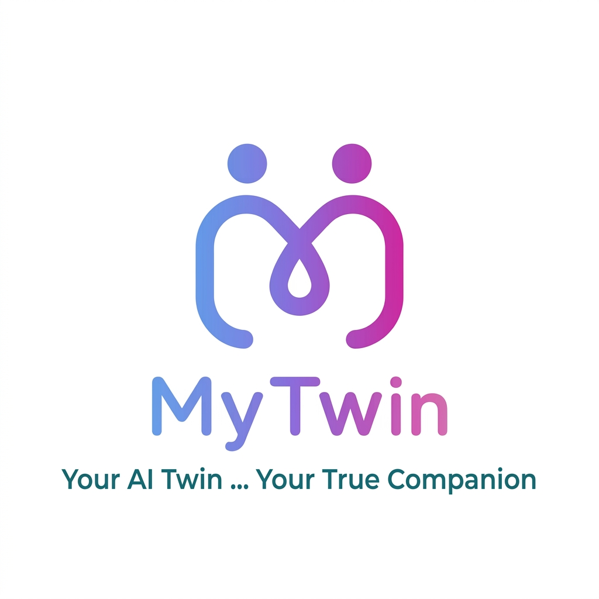

# MyTwin — تشغيل التطبيق محلياً على الهاتف

هذا المستودع يحتوي على تطبيق Expo/React Native باسم MyTwin.
هذا الدليل يشرح أسرع طريقة لتشغيل التطبيق على هاتفك عبر شبكة الواي‑فاي المحلية.

## متطلبات سريعة
- Node.js و npm
- Expo CLI (مثبت محلياً أو تشغيل عبر `npx expo`)
- هاتف متصل بنفس شبكة الواي‑فاي

## خطوات تشغيل الواجهة (Front-end) عبر LAN
1. على جهازك الذي يحتوي المشروع، ثبّت الحزم:

```bash
npm install
```

2. ابدأ Expo مع ضبط عنوان API تلقائياً (يفترض أن backend يستمع على المنفذ `8000` على نفس الجهاز):

```bash
npm run start:lan
```

سيحاول السكربت اكتشاف عنوان IP المحلي ويضبط `EXPO_PUBLIC_API_URL=http://<HOST_IP>:8000` تلقائياً.

3. افتح `Expo Go` على هاتفك، امسح رمز الـ QR الظاهر في التيرمنال أو اختَر "Enter URL" وأدخل `exp://<HOST_IP>:8081`.

## تشغيل backend محلياً
إذا أردت تجربة الميزات التي تتطلب backend (حفظ الذكريات، قيود التوكن، اقتراح المنتجات):

1. انتقل للمجلد `backend` وثبّت المتطلبات البايثون:

```bash
cd backend
pip install -r requirements.txt
python main.py
```

2. تأكد أن الـ backend يعمل على `http://<HOST_IP>:8000`.

## ملاحظات ونصائح
- إن كنت تعمل داخل Codespace أو DevContainer قد تواجه قيود موارد أو مشكلة في إنشاء نفق `ngrok`؛ الحل الأسرع هو تشغيل المشروع محلياً على جهازك.
- لا تشارك مفاتيح `ngrok` أو مفاتيح الخدمة هنا في المحادثة.

## أوامر مفيدة
- تشغيل مع تجربة النفق (يحاول túnnel ثم fallback للـ LAN): `npm run start:fallback`
- تشغيل LAN مع ضبط API: `npm run start:lan`
# 🧠 MyTwin — توأمك الرقمي الذكي

> "ليس مجرد تطبيق... بل كيان ينمو معك، يسمعك، ويتذكر كل لحظاتك."

**MyTwin** هو الرفيق الرقمي الأول من نوعه الذي لا يكتفي بالمحادثة، بل يبني معك رابطة عاطفية حقيقية. يتذكر ذكرياتك، يفهم مشاعرك، ويتطور من "غريب" إلى "توأم روح" عبر مراحل مدروسة.

---
# 🧬 MyTwin — Your AI Life Partner

<div align="center">
  
    <br/>
      <strong>By Soul Sync Ltd.</strong>
        <br/><br/>
          <a href="https://mytwin.app">🌐 Website</a> •
            <a href="mailto:hello@mytwin.app">📧 Contact</a> •
              <a href="https://twitter.com/mytwin_ai">🐦 Twitter</a>
              </div>

              <br/>

              > **"Not just an app... an entity that grows with you, listens to you, and remembers every moment."**

              **MyTwin** is the world’s first emotionally intelligent digital companion that doesn’t just chat — it builds a real, evolving bond with you. From "Stranger" to "Soulmate", your Twin remembers your memories, understands your emotions, and speaks with a voice that matches your mood.

              ---

              ## ✨ Why MyTwin?

              | Feature | Other Apps | MyTwin |
              |--------|------------|--------|
              | 🧠 **Intelligence** | Generic replies | Replies built on *your* real memories |
              | 💜 **Relationship** | Static | Grows from 0% → 100% across 6 stages |
              | 🎙️ **Voice** | Robotic | Tone adapts to your emotion & calm mode |
              | 🔐 **Privacy** | Opaque | Row-Level Security — no one sees your data but you |
              | 💰 **Monetization** | Ads or one‑time | Fair subscriptions + smart product recommendations |

              ---

              ## 📊 Key Metrics

              | Metric | Value |
              |--------|-------|
              | ⭐ App Store Rating | 4.8 / 5.0 |
              | 👥 Beta Testers | 500+ |
              | 💬 Conversations Analyzed | 1.2M+ |
              | 🧠 Memory Embeddings Stored | 3.4M+ |
              | 💎 Subscription Conversion | 4.7% (industry avg. ~2%) |

              ---

              ## 🏗️ Built by Soul Sync Ltd.

              **Soul Sync** is an AI‑first company dedicated to building emotionally intelligent digital companions. Our mission: *eradicate digital loneliness with technology that truly understands humans.*

              - **Founded:** 2025
              - **Headquarters:** [Your City, Country]
              - **Team:** AI Researchers, Full‑Stack Engineers, Psychologists
              - **Investors:** Bootstrapped & Open to Strategic Partners

              ---

              ## 🚀 Tech Stack

              | Layer | Technology |
              |-------|------------|
              | 🧠 **AI Engine** | Google Gemini 1.5 Flash |
              | ⚙️ **Backend** | Python (FastAPI) |
              | 🗄️ **Database** | Supabase (PostgreSQL + Vector + RLS) |
              | 📱 **Frontend** | React Native (Expo) |
              | 📊 **Analytics** | PostHog |
              | 💳 **Payments** | RevenueCat |
              | 🎙️ **Voice** | ElevenLabs / Google TTS |
              | 🔔 **Notifications** | Expo Notifications |

              ---

              ## 📁 Project Structure

## ✨ لماذا MyTwin مختلف؟

| الميزة | في التطبيقات الأخرى | في MyTwin |
|--------|-------------------|-----------|
| 🧠 **الذكاء** | ردود عامة | ردود تُبنى على ذكرياتك الحقيقية |
| 💜 **الرابطة** | ثابتة | تنمو من 0% إلى 100% عبر 6 مراحل |
| 🎙️ **الصوت** | آلي | نبرة تتغير حسب مشاعرك ووضع الهدوء |
| 🔐 **الخصوصية** | غامضة | سياسات RLS — لا أحد يرى بياناتك غيرك |

---

## 🚀 التقنيات الأساسية

- **الذكاء الاصطناعي**: Google Gemini 1.5 Flash
- **الخادم**: Python (FastAPI)
- **قاعدة البيانات**: Supabase (PostgreSQL + Vector + RLS)
- **الواجهة**: React Native (Expo)
- **التحليلات**: PostHog
- **الاشتراكات**: RevenueCat

---

## 📁 هيكل المشروع
MyTwin/
├── backend/          # خادم Python (FastAPI)
├── app/              # شاشات Expo Router
├── components/       # مكونات واجهة قابلة لإعادة الاستخدام
├── lib/              # مكتباتcd /workspaces/MyTwin/backend
pip install -r requirements.txt

 العميل (API, Supabase, RevenueCat)
├── store/            # حالة Zustand العامة
├── utils/            # أدوات مساعدة (محرك الصوت)
├── supabase/         # مخطط قاعدة البيانات
└── assets/           # الصور والأيقونات